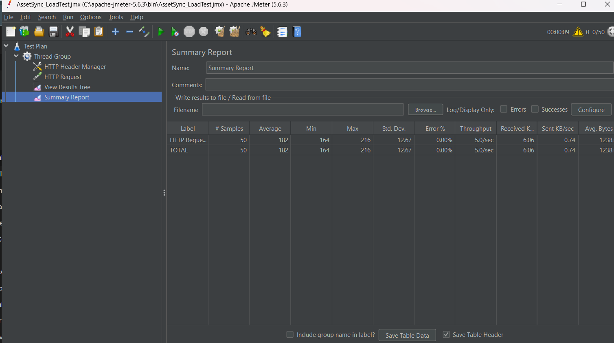
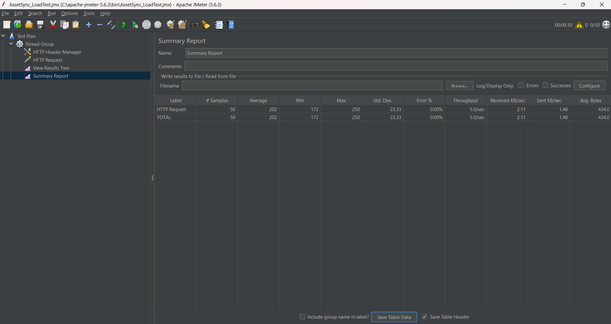

# 🚀 QA Automation Portfolio: AssetSync

AssetSync adalah aplikasi *Full-Stack* (berbasis Laravel) untuk manajemen aset sederhana yang saya kembangkan secara mandiri dengan tujuan utama sebagai *environment* pengujian automasi perangkat lunak (QA Automation). Proyek ini mencakup pengujian **UI/End-to-End** dan **API Testing**.

## 🛠️ Tech Stack & Tools
- **Aplikasi Web:** Laravel 11, PHP, MySQL, Tailwind CSS
- **UI Automation:** Python, Selenium WebDriver
- **API Automation:** Postman, JavaScript (Chai Assertion Library)
- **Test Management:** Google Sheets

## 📊 Dokumen Test Plan & Test Case
Dokumentasi perencanaan QA, pengelompokan modul, serta detail eksekusi (*Expected vs Actual Result*) telah disusun secara terstruktur berdasarkan standar industri.
👉 **[Lihat Dokumen QA Test Case di Sini](https://docs.google.com/spreadsheets/d/16W5cFRj882c0AOWtcBeK7Sm-r6tP3Og1zi2P78lS4o0/edit?usp=sharing)**

## 🧪 Skenario Automasi (Test Scenarios)

### 1. UI Automation Testing (Selenium)
Lokasi Skrip: `qa-automation/ui-test/test_assetsync.py`

**Skenario yang Diuji:**
- **[Positive] E2E Add Asset:** Melakukan proses *login* valid, mengisi *form* penambahan barang, dan memverifikasi notifikasi sukses serta kemunculan data di dalam tabel.
- **[Negative] Invalid Login:** Memasukkan kredensial yang salah dan memverifikasi sistem menolak akses serta memunculkan pesan *error* validasi.

### 2. API Automation Testing (Postman)
Lokasi Skrip: `qa-automation/api-test/AssetSync_API_Test.postman_collection.json`

**Skenario yang Diuji:**
- **[Positive] GET `/api/items`:** Mengambil daftar aset. Memverifikasi status `200 OK`, waktu respons `< 500ms`, dan format data (Array).
- **[Positive] POST `/api/items`:** Menambahkan aset baru. Memverifikasi status `201 Created` dan kecocokan data (*Data Integrity*) yang di-*generate* oleh sistem.
- **[Negative] POST `/api/items`:** Mengirimkan *payload* kosong dan harga minus. Memverifikasi *server* memblokir *request* dengan status `422 Unprocessable Entity` dan memvalidasi struktur *error*.

### 3. API Performance & Load Testing (Apache JMeter)
Melakukan pengujian performa dan ketahanan beban pada REST API AssetSync untuk menyimulasikan akses konkuren multi-pengguna pada jam sibuk.

**Skenario Pengujian Beban Baca (GET):**
- **Target Endpoint:** `GET /api/items` (Mengambil daftar inventaris)
- **Simulasi Beban:** 50 Concurrent Users (Ramp-Up: 10 detik)
- **Hasil Pengujian:**
  - **Success Rate:** 100% (Error Rate: 0.00%)
  - **Rata-rata Response Time:** 182 ms
  - **Analisis:** API mampu melayani permintaan baca data secara massal dengan stabil tanpa degradasi performa.



**Skenario Pengujian Beban Tulis (POST):**
- **Target Endpoint:** `POST /api/items` (Menambah data barang baru)
- **Simulasi Beban:** 50 Concurrent Users (Ramp-Up: 10 detik)
- **Payload:** Format JSON (`application/json`)
- **Hasil Pengujian:**
  - **Success Rate:** 100% (Error Rate: 0.00%)
  - **Analisis:** Database sanggup menangani *concurrent insert* 50 data baru dalam 10 detik tanpa mengalami *database deadlock* atau HTTP 500 Server Error.



## ⚙️ Cara Menjalankan Proyek & Automasi

### 1. Menjalankan UI Automation
```bash
cd qa-automation/ui-test
pip install selenium webdriver-manager
python test_assetsync.py
